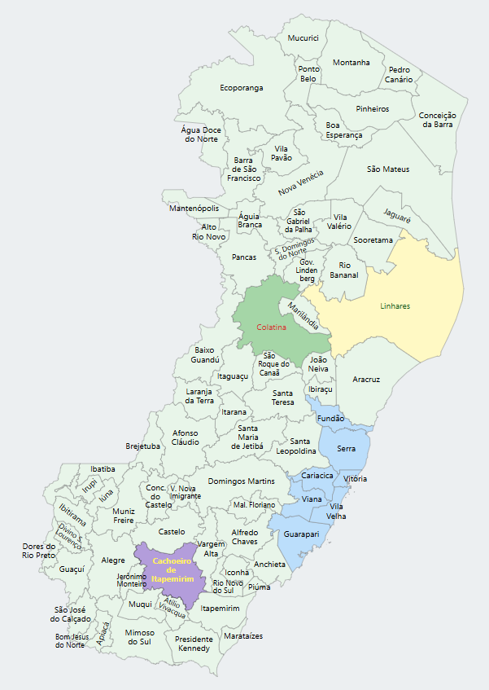

# mapaSvg.js - Mapa Iterativo do Espírito Santo

Crie um gráfico do estado do Espírito Santo, totalmente customizável e iterativo.

### Link para demonstração: https://luclorencini.github.io

#### Funcionalidades principais

- Inicialização do mapa SVG com eventos de hover e interação.
- Manipulação dos traçados dos municípios, incluindo alteração de cor e visibilidade.
- Manipulação dos nomes dos municípios, incluindo alteração de cor, estilo (negrito) e visibilidade.
- Eventos interativos para destacar municípios ao passar o mouse.



## Índice

- [Download](#download)
- [Exemplos de Uso](#exemplos-de-uso)
- [Documentação](#documentação)
- [Sobre os arquivos](#sobre-os-arquivos)
- [Contribuição](#contribuição)
- [Licença](#licença)
- [Próximos Passos](#próximos-passos)
- [Contato](#contato)

## Download

Existem duas maneiras de baixar os arquivos do projeto:

### 1. **Baixar pela página de releases**

Você pode acessar a [Página de Releases](https://github.com/luclorencini/mapaSvg.js/releases) do projeto no GitHub e fazer o download da versão mais recente do projeto. Na página, clique no arquivo desejado para realizar o download.

### 2. **Baixar diretamente da pasta `dist`**

Se preferir, você também pode fazer o download dos arquivos diretamente da pasta `dist` do repositório. Basta acessar o repositório e navegar até a pasta `dist` para obter os arquivos mais recentes.


## Exemplos de Uso

### Carregando o arquivo SVG

A melhor forma de inserir um SVG na página de forma a poder manipulá-lo é carregando-o com `fetch` e inserir no DOM. Ao fazer isso, as tags internas do SVG passam a fazer parte do DOM, o que nos permite manipulá-los com css e javascript

```javascript
const response = await fetch('mapa-es.svg');
const svgContent = await response.text();

const container = document.querySelector('#map-holder');
container.innerHTML = svgContent;
```

O código acima realiza o seguinte processo:
 - Usa o `fetch` para buscar o arquivo SVG.
 - Converte o conteúdo da resposta para texto com `response.text()`.
 - Localiza a `<div>` com o id `#map-holder` e insere o conteúdo SVG diretamente dentro dela com `container.innerHTML = svgContent`.

> **Importante**: O uso de `fetch` não funciona em arquivos locais no sistema de arquivos. Para executar este exemplo, recomendamos o uso do Visual Studio Code com o plug-in **Live Server**, permitindo que você execute o código via `localhost`.


### Inicializando o mapa

Após carregar o SVG, basta agora obtê-lo e chamar o método `init` informando-o como parâmetro:

```javascript
const svgElement = container.querySelector('svg'); // Obtém o SVG do mapa recèm-carregado na página
mapaSvg.init(svgElement);
```

### Alterando a cor de um município

Para alterar a cor de um município específico, use o método `setTracado()`, passando o código IBGE do município e as cores desejadas para o preenchimento (`fill`) e a borda (`stroke`).

```javascript
mapaSvg.setTracado("3205309", "#ff0000", "#000000");  // Altera a cor de preenchimento e borda do município com o código IBGE 3205309 (Vitória)
```

### Exibindo ou escondendo traçados e nomes

Você pode exibir ou esconder os traçados e os nomes de um município ou de todos os municípios:

```javascript
mapaSvg.hideAllTracados();  // Esconde todos os traçados
mapaSvg.showTracado("3203205");  // Exibe o traçado do município com o código IBGE 3203205 (Linhares)
mapaSvg.hideNome("3201506");  // Esconde o nome do município com o código IBGE 3201506 (Colatina)
```

### Alterando o estilo dos nomes dos municípios

Você pode alterar a cor e o estilo (negrito) dos nomes dos municípios individualmente ou de todos os municípios:

```javascript
mapaSvg.setAllNomes("#ff0000", false);  // Altera a cor de todos os nomes para vermelho e remove o negrito
mapaSvg.setNome("3201209", "#0000ff", true);  // Altera a cor para azul e aplica negrito no nome do município com o código IBGE 3201209 (Cachoeiro de Itapemirim)
```

### Manipulando todos os traçados e nomes

Você pode alterar as cores de todos os traçados e nomes de uma vez:
```javascript
mapaSvg.setAllTracados("#00ff00", "#000000");  // Altera a cor de preenchimento e borda de todos os traçados
mapaSvg.setAllNomes("#ff00ff", true);  // Altera a cor de todos os nomes para roxo e aplica negrito
```

### Alterando as cores de um município ao passar o mouse sobre ele

Você pode definir a cor do traçado, da borda e do nome de um município ao passar o mouse sobre ele (efeito de hover):
```javascript
const corFill = '#3498db';   // Cor de preenchimento para todos
const corStroke = '#2980b9'; // Cor da borda para todos
const corName = '#2c3e50';   // Cor do nome para todos

mapaSvg.setHover('3204906', corFill, corStroke, corName); // Aplica o efeito hover ao passar o mouse sobre o município com o código IBGE 3204906 (São Mateus)
```
### Alterando as cores de todos os municípios ao passar o mouse sobre qualquer um deles

Você pode definir as cores de hover para todos os municípios de uma vez. Vale ressaltar que, caso não deseje alterar um determinado atributo, basta informar `null` ou `undefined` para esse atributo, e ele será ignorado.

```javascript
const corFill = '#3498db';   // Cor de preenchimento para todos
const corStroke = null;      // Não iremos alterar a cor da borda 
const corName = '#2c3e50';   // Cor do nome para todos

setAllHover(corFill, corStroke, corName); // Aplica o efeito hover em todos os municípios
```

### Eventos

Você pode configurar eventos nos municípios contidos no atributo `tracados`. O código abaixo demonstra como configurar `click` para todos os traçados de município:

```javascript
mapaSvg.tracados.forEach(t => {
  t.addEventListener("click", () => {
    alert(t.id);
  });
}); 
```

## Documentação

### Atributos

| Atributo     | Tipo                                     | Descrição                                                                 |
|--------------|------------------------------------------|---------------------------------------------------------------------------|
| `tracados`   | `NodeListOf<SVGPathElement>`             | Lista de todos os elementos `path` que representam os traçados dos municípios. |
| `nomes`      | `NodeListOf<SVGTextElement \| SVGGElement>` | Lista de todos os elementos de texto (`text` ou `group`) que representam os nomes dos municípios. |
| `svgElement` | `SVGSVGElement`                          | O elemento SVG que contém o mapa do Espírito Santo.                       |

### Métodos

Nota: todos os parâmetros marcados como opcionais serão ignorados se você informar `null` ou `undefined`.

| Método                | Descrição                                                                 | Parâmetros                                        | Retorno    |
|-----------------------|---------------------------------------------------------------------------|--------------------------------------------------|------------|
| `init(svgElement)`  | Inicializa o manipulador do mapa SVG, configurando os elementos e eventos de interação. | `svgElement` (SVGSVGElement) - O elemento SVG que contém o mapa. | `void`     |
| `getTracado(codigoIbge)`      | Obtém o traçado (elemento `path`) de um município a partir do código IBGE. | `codigoIbge` (string) - Código IBGE do município. | `SVGPathElement \| null` |
| `setTracado(codigoIbge, corFill, corStroke)` | Define as cores de preenchimento (`fill`) e borda (`stroke`) de um traçado de município. | `codigoIbge` (string) - Código IBGE do município.<br> `corFill` (string) - Cor de preenchimento (opcional).<br> `corStroke` (string) - Cor da borda (opcional). | `void` |
| `setAllTracados(corFill, corStroke)` | Define as cores de preenchimento e borda para todos os traçados dos municípios. | `corFill` (string) - Cor de preenchimento.<br> `corStroke` (string) - Cor da borda. | `void` |
| `hideTracado(codigoIbge)` | Esconde o traçado de um município a partir do código IBGE. | `codigoIbge` (string) - Código IBGE do município. | `void` |
| `hideAllTracados()` | Esconde todos os traçados dos municípios. | - | `void` |
| `showTracado(codigoIbge)` | Exibe o traçado de um município a partir do código IBGE. | `codigoIbge` (string) - Código IBGE do município. | `void` |
| `showAllTracados()` | Exibe todos os traçados dos municípios. | - | `void` |
| `getNome(codigoIbge)` | Obtém o nome (elemento `text` ou `group`) de um município a partir do código IBGE. | `codigoIbge` (string) - Código IBGE do município. | `SVGTextElement \| SVGGElement \| null` |
| `setNome(codigoIbge, corHex, isNegrito)` | Define a cor e o estilo de texto (negrito) de um nome de município. | `codigoIbge` (string) - Código IBGE do município.<br> `corHex` (string) - Cor hexadecimal a ser aplicada (opcional).<br> `isNegrito` (boolean) - Define se o nome será em negrito (opcional). | `void` |
| `setAllNomes(corHex, isNegrito)` | Define a cor e o estilo de texto (negrito) para todos os nomes dos municípios. | `corHex` (string) - Cor hexadecimal a ser aplicada.<br> `isNegrito` (boolean) - Define se os nomes serão em negrito. | `void` |
| `hideNome(codigoIbge)` | Esconde o nome de um município a partir do código IBGE. | `codigoIbge` (string) - Código IBGE do município. | `void` |
| `hideAllNomes()` | Esconde todos os nomes dos municípios. | - | `void` |
| `showNome(codigoIbge)` | Exibe o nome de um município a partir do código IBGE. | `codigoIbge` (string) - Código IBGE do município. | `void` |
| `showAllNomes()` | Exibe todos os nomes dos municípios. | - | `void` |
| `setHover(codigoIbge, corFill, corStroke, corName)` | Define as cores de preenchimento, borda e nome de um município **ao passar o mouse sobre seu traçado**.<br> Ao tirar o cursor do mouse sobre o município, ele retorna às cores definidas anteriormente. | `codigoIbge` (string) - Código IBGE do município.<br> `corFill` (string) - Cor de preenchimento do traçado (opcional).<br> `corStroke` (string) - Cor da borda do traçado (opcional).<br> `corName` (string) - Cor do nome do município (opcional). | `void` |
| `setAllHover(corFill, corStroke, corName)` | Define as cores de preenchimento, borda e texto de um município para todos os traçados dos municípios **ao passar o mouse sobre eles.** | `corFill` (string) - Cor de preenchimento (opcional).<br> `corStroke` (string) - Cor da borda (opcional).<br> `corName` (string) - Cor do nome (opcional). | `void` |

## Sobre os arquivos

### mapaSvg.js

O arquivo **mapaSvg.js** define objeto `mapaSvg`, que encapsula funcionalidades para manipular o arquivo `mapa-es.svg` descrito abaixo. Ele permite interagir com os elementos SVG, manipulando suas cores, visibilidade e estilos, além de configurar eventos de interação, como o destaque de municípios ao passar o mouse. Toda a documentação acima se refere a este objeto.

### mapa-es.svg

O arquivo `mapa-es.svg` representa o mapa do estado do Espírito Santo, Brasil, e contém todos os 78 municípios do estado. 

O formato adotado é o SVG (Scalable Vector Graphics) usado para criar gráficos vetoriais bidimensionais e, por isso, podem ser escalados sem perder qualidade. Arquivos SVG podem ser manipulados com JavaScript e CSS e são compatíveis com todos os navegadores modernos, o que os torna ideal para gráficos interativos em aplicações web.

O mapa é formado por dois principais conjuntos de elementos:

**Traçados dos municípios**: Cada município é representado por um elemento `<path>`, e o id de cada `<path>` corresponde ao código IBGE do município. Esse código IBGE é usado para identificar e manipular os traçados individualmente através dos métodos do objeto `mapaSvg`, como `getTracado()`, `setTracado()`, e outros relacionados ao controle de traçados.

**Nomes dos municípios**: Os nomes dos municípios são representados por elementos `<text>` (quando o nome do município cabe em apenas uma linha) ou `<g>` (grupo de textos), quando o nome do município precisa de 2 ou mais linhas dentro do mapa. Neste caso, o grupo contém elementos `<text>` para cada linha de texto. Cada `<text>` ou `<g>` tem um id correspondente ao código IBGE do município, o que permite a manipulação dos nomes dos municípios através dos métodos do objeto `mapaSvg`, como `getNome()`, `setNome()`, e outros relacionados à exibição e formatação de nomes.

#### Estrutura do SVG

- `<svg>`: A tag raiz do arquivo SVG que define o mapa do estado do Espírito Santo. Exemplo:

```xml
<svg version="1.1" x="0px" y="0px">
```

- `<g id="tracados">`: Um grupo de elementos `<path>` que representam os limites dos municípios. Cada `<path>` tem um id correspondente ao código IBGE do município. Exemplo:

```xml
<g id="tracados">
  <path id="3205309" d="M354.948,551.208 ..."/>
  <path id="3205200" d="M327.611,589.155 ..."/>
  <!-- Outros elementos path para os municípios -->
</g>
```

- `<g id="nomes">`: Um grupo de elementos `<text>` ou `<g>` (grupo de textos) que representa o nome de cada município. O id de cada elemento de texto corresponde ao código IBGE do município. Exemplo:

```xml
<g id="nomes">
  <text id="3205309" x="364.77815" y="545.33657">Vitória</text>
  <g id="3205200">
    <text x="349.91283" y="575.33916">Vila</text>
    <text x="346.20913" y="585.92117">Velha</text>
  </g>  
  <!-- Outros elementos text para os nomes dos municípios -->
</g>
```

O tamanho padrão do SVG do **mapa-es.svg** é:

```
height="790px"
width="540px"
```

## Contribuição

Se você encontrar problemas ou quiser melhorar o código, sinta-se à vontade para enviar pull requests. Para contribuir, basta clonar o repositório, fazer as alterações e enviar um pull request com uma descrição clara das modificações.

## Licença

Este projeto está licenciado sob a [MIT License](LICENSE) - veja o arquivo `LICENSE` para mais detalhes.

## Próximos Passos

Existe a vontade de inserir mapas de mais estados brasileiros na biblioteca. Se você tiver interesse no uso, mas seu estado não está contemplado, entre em contato que iremos inseri-lo sob demanda.

## Contato

Se você tiver alguma dúvida ou sugestão, entre em contato:

Email: lorencini@gmail.com