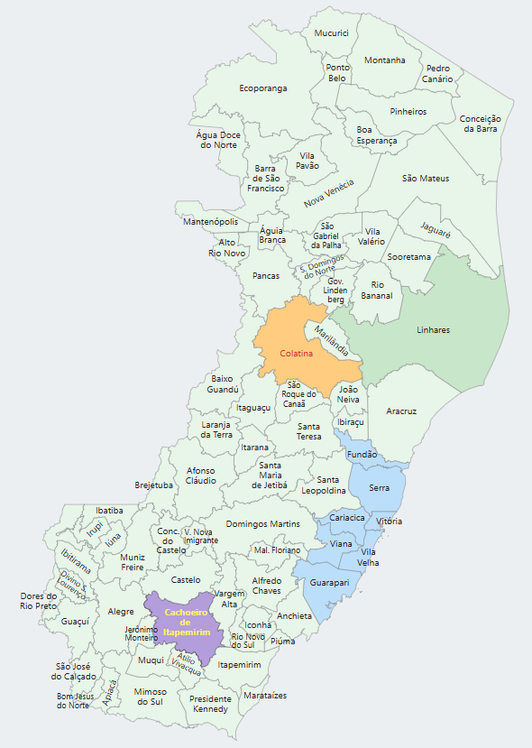

# MapaEsHandler - Manipulação de Mapa SVG do Espírito Santo

Este projeto foi criado como base para criação de gráficos web usando o mapa do estado do Espírito Santo de forma iterativa.

São fornecidos dois arquivos principais:

O arquivo

O arquivo SVG contém o desenho de todos os 78 municípios capixabas, além do nome de cada município disposto de forma a identificá-lo.



## Índice

1. [Sobre o SVG](#sobre)
2. [Exemplo de Uso](#exemplo)
3. [Contribuição]
5. [Licença](#licença)
6. [Contato](#contato)

## Sobre

Este projeto foi criado como base para criação de gráficos web usando o mapa do estado do Espírito Santo de forma iterativa.

O arquivo SVG contém o desenho de todos os 78 municípios capixabas, além do nome de cada município disposto de forma a identificá-lo.


## Arquivo SVG

O arquivo SVG representa o mapa do estado do Espírito Santo, Brasil, e contém todos os 78 municípios do estado. O mapa é formado por dois principais conjuntos de elementos:

Traçados dos municípios: Cada município é representado por um elemento <path>, e o id de cada <path> corresponde ao código IBGE do município. Esse código IBGE é usado para identificar e manipular os traçados individualmente através dos métodos do objeto mapaHandler, como getTracado(), setTracado(), e outros relacionados ao controle de traçados.

Nomes dos municípios: Os nomes dos municípios são representados por elementos <text> ou <g> (grupo de textos). Cada <text> ou <g> tem um id correspondente ao código IBGE do município, o que permite a manipulação dos nomes dos municípios através dos métodos do objeto mapaHandler, como getNome(), setNome(), e outros relacionados à exibição e formatação de nomes.

Estrutura do SVG
<svg>: A tag raiz do arquivo SVG que define o mapa do estado do Espírito Santo.

<g id="tracados">: Um grupo de elementos <path> que representam os limites dos municípios. Cada <path> tem um id correspondente ao código IBGE do município.

Exemplo:

xml
Copiar código
<g id="tracados">
  <path id="3205308" d="M10,10 L20,20 ..."/>
  <path id="3205207" d="M30,30 L40,40 ..."/>
  <!-- Outros elementos path para os municípios -->
</g>
<g id="nomes">: Um grupo de elementos <text> ou <g> (grupo de textos) que representa o nome de cada município. O id de cada elemento de texto corresponde ao código IBGE do município.

Exemplo:

xml
Copiar código
<g id="nomes">
  <text id="3205308" x="15" y="15">Vitória</text>
  <text id="3205207" x="35" y="35">Vila Velha</text>
  <!-- Outros elementos text para os nomes dos municípios -->
</g>

O objeto `mapaEsHandler` encapsula funcionalidades para manipular o arquivo SVG chamado `mapa-es.svg` contendo o mapa do estado do Espírito Santo, que inclui os traçados e nomes de todos os 78 municípios. Ele permite interagir com os elementos SVG, manipulando suas cores, visibilidade e estilos, além de configurar eventos de interação, como o destaque de municípios ao passar o mouse.

## Funcionalidades principais

- Inicialização do mapa SVG com eventos de hover e interação.
- Manipulação dos traçados dos municípios, incluindo alteração de cor e visibilidade.
- Manipulação dos nomes dos municípios, incluindo alteração de cor, estilo (negrito) e visibilidade.
- Eventos interativos para destacar municípios ao passar o mouse.

## Atributos

| Atributo     | Tipo                                     | Descrição                                                                 |
|--------------|------------------------------------------|---------------------------------------------------------------------------|
| `tracados`   | `NodeListOf<SVGPathElement>`             | Lista de todos os elementos `path` que representam os traçados dos municípios. |
| `nomes`      | `NodeListOf<SVGTextElement | SVGGElement>` | Lista de todos os elementos de texto (`text` ou `group`) que representam os nomes dos municípios. |
| `svgElement` | `SVGSVGElement`                          | O elemento SVG que contém o mapa do Espírito Santo.                       |
| `corHover`   | `string`                                 | Cor de destaque usada para o efeito de hover nos traçados dos municípios. O valor padrão é `"#fff59d"`. |

## Métodos

| Método                | Descrição                                                                 | Parâmetros                                        | Retorno    |
|-----------------------|---------------------------------------------------------------------------|--------------------------------------------------|------------|
| `init(svgElement, corHover)`  | Inicializa o manipulador do mapa SVG, configurando os elementos e eventos de interação. | `svgElement` (SVGSVGElement) - O elemento SVG que contém o mapa.<br> `corHover` (string) - Cor de hover (opcional). | `void`     |
| `getTracado(codigoIbge)`      | Obtém o traçado (elemento `path`) de um município a partir do código IBGE. | `codigoIbge` (string) - Código IBGE do município. | `SVGPathElement|null` |
| `setTracado(codigoIbge, corFill, corStroke)` | Define as cores de preenchimento (`fill`) e borda (`stroke`) de um traçado de município. | `codigoIbge` (string) - Código IBGE do município.<br> `corFill` (string) - Cor de preenchimento (opcional).<br> `corStroke` (string) - Cor da borda (opcional). | `void` |
| `setAllTracados(corFill, corStroke)` | Define as cores de preenchimento e borda para todos os traçados dos municípios. | `corFill` (string) - Cor de preenchimento.<br> `corStroke` (string) - Cor da borda. | `void` |
| `hideTracado(codigoIbge)` | Esconde o traçado de um município a partir do código IBGE. | `codigoIbge` (string) - Código IBGE do município. | `void` |
| `hideAllTracados()` | Esconde todos os traçados dos municípios. | - | `void` |
| `showTracado(codigoIbge)` | Exibe o traçado de um município a partir do código IBGE. | `codigoIbge` (string) - Código IBGE do município. | `void` |
| `showAllTracados()` | Exibe todos os traçados dos municípios. | - | `void` |
| `getNome(codigoIbge)` | Obtém o nome (elemento `text` ou `group`) de um município a partir do código IBGE. | `codigoIbge` (string) - Código IBGE do município. | `SVGTextElement | SVGGElement | null` |
| `setNome(codigoIbge, corHex, isNegrito)` | Define a cor e o estilo de texto (negrito) de um nome de município. | `codigoIbge` (string) - Código IBGE do município.<br> `corHex` (string) - Cor hexadecimal a ser aplicada.<br> `isNegrito` (boolean) - Define se o nome será em negrito. | `void` |
| `setAllNomes(corHex, isNegrito)` | Define a cor e o estilo de texto (negrito) para todos os nomes dos municípios. | `corHex` (string) - Cor hexadecimal a ser aplicada.<br> `isNegrito` (boolean) - Define se os nomes serão em negrito. | `void` |
| `hideNome(codigoIbge)` | Esconde o nome de um município a partir do código IBGE. | `codigoIbge` (string) - Código IBGE do município. | `void` |
| `hideAllNomes()` | Esconde todos os nomes dos municípios. | - | `void` |
| `showNome(codigoIbge)` | Exibe o nome de um município a partir do código IBGE. | `codigoIbge` (string) - Código IBGE do município. | `void` |
| `showAllNomes()` | Exibe todos os nomes dos municípios. | - | `void` |

## Exemplo de Uso

### Inicializando o mapa

```javascript
const svgElement = document.getElementById('mapa-es');  // Supondo que já exista um SVG com este id no HTML
mapaHandler.init(svgElement, "#ffcc00");  // Inicializa com a cor de hover personalizada
```

### Alterando a cor de um município

Para alterar a cor de um município específico, use o método `setTracado()`, passando o código IBGE do município e as cores desejadas para o preenchimento (`fill`) e a borda (`stroke`).

```javascript
mapaHandler.setTracado("3205309", "#ff0000", "#000000");  // Altera a cor de preenchimento e borda do município com o código IBGE 3205309 (Vitória)
```

### Exibindo ou escondendo traçados e nomes

Você pode exibir ou esconder os traçados e os nomes de um município ou de todos os municípios:

```javascript
mapaHandler.hideAllTracados();  // Esconde todos os traçados
mapaHandler.showTracado("3203205");  // Exibe o traçado do município com o código IBGE 3203205 (Linhares)
mapaHandler.hideNome("3201506");  // Esconde o nome do município com o código IBGE 3201506 (Colatina)
```

### Alterando o estilo dos nomes dos municípios

Você pode alterar a cor e o estilo (negrito) dos nomes dos municípios individualmente ou de todos os municípios:

```javascript
mapaHandler.setNome("3201209", "#0000ff", true);  // Altera a cor e aplica negrito no nome do município com o código IBGE 3201209 (Cachoeiro de Itapemirim)
mapaHandler.setAllNomes("#ff0000", false);  // Altera a cor de todos os nomes para vermelho e remove o negrito
```

### Manipulando todos os traçados e nomes

Você pode alterar as cores de todos os traçados e nomes de uma vez:
```javascript
mapaHandler.setAllTracados("#00ff00", "#000000");  // Altera a cor de preenchimento e borda de todos os traçados
mapaHandler.setAllNomes("#ff00ff", true);  // Altera a cor de todos os nomes para roxo e aplica negrito
```


## Contribuição

Se você encontrar problemas ou quiser melhorar o código, sinta-se à vontade para enviar pull requests. Para contribuir, basta clonar o repositório, fazer as alterações e enviar um pull request com uma descrição clara das modificações.

## Licença
Este projeto está licenciado sob a [MIT License](LICENSE) - veja o arquivo `LICENSE` para mais detalhes.

## Contato

Se você tiver alguma dúvida ou sugestão, entre em contato:

Email: lorencini@gmail.com